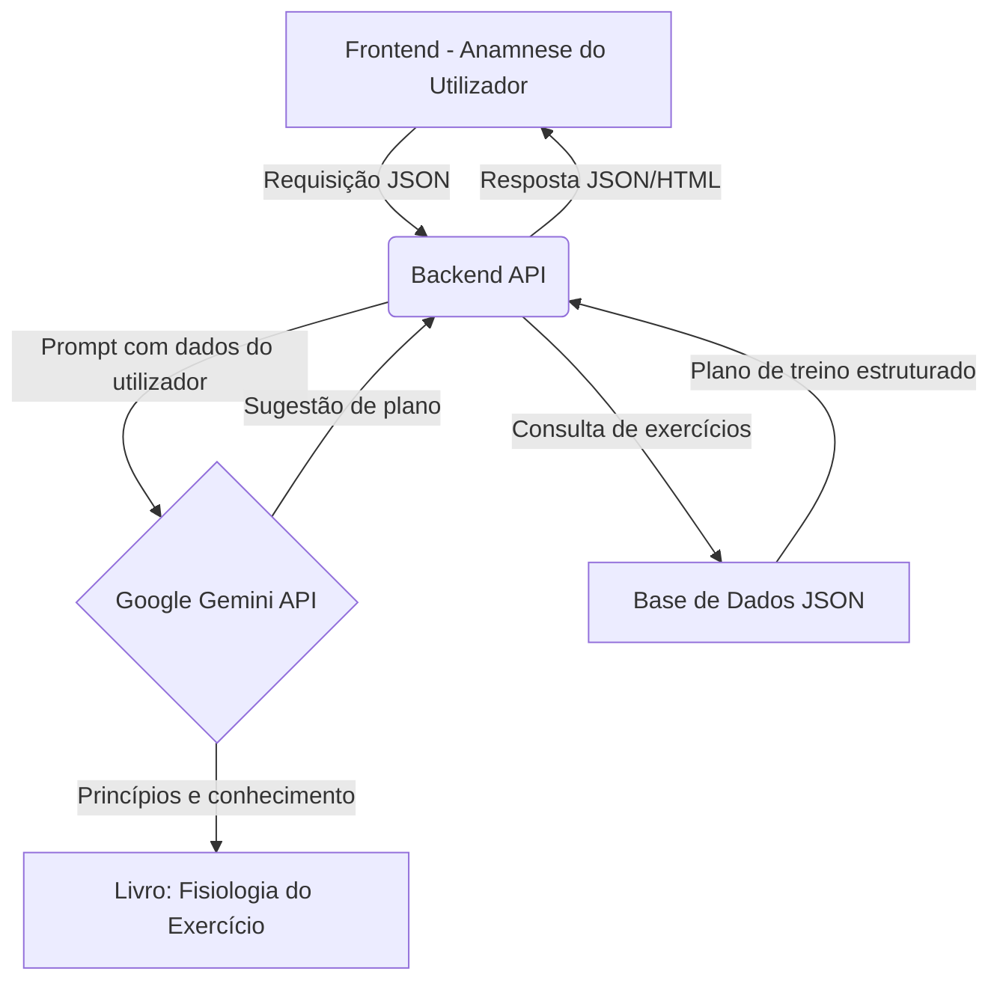

# Exercise-Advisor 

## 🏋️‍♂️ Sobre o Projeto
O **Exercise-Advisor** nasceu da necessidade de uma orientação de treinos que seja verdadeiramente personalizada e fundamentada em ciência.  
Enquanto a maioria das aplicações oferece planos genéricos, nosso objetivo é criar um assistente inteligente que sugere rotinas de treino baseadas em seus **dados antropométricos**, **objetivos** e na vasta literatura da **fisiologia do exercício**.

Utilizando o poder da **IA Generativa do Google (Gemini)** e os princípios consagrados do livro *"Fisiologia do Exercício, Nutrição, Energia e Desempenho Humano"* de McArdle, Katch & Katch, este projeto visa fornecer **sugestões de treino detalhadas, seguras e eficazes**, completas com demonstrações em vídeo e dicas práticas.

> **Importante**: Este projeto destina-se a fins **educacionais** e de **sugestão**.  
> As recomendações geradas não substituem a orientação de um profissional de educação física ou médico.  
> Sempre consulte um especialista antes de iniciar qualquer programa de exercícios.

---

## ✨ Funcionalidades Planejadas
- **Catálogo Extensivo de Exercícios**: Uma base de dados em JSON com exercícios comuns, incluindo links para demonstrações em vídeo no YouTube.  
- **Anamnese Inteligente**: Uma interface frontal para coletar suas medidas antropométricas, nível de experiência e objetivos.  
- **Sugestões com IA**: O motor principal usará a API Gemini, alimentada com conhecimento de fisiologia, para criar planos de treino personalizados.  
- **Exportação de Treinos**: Exporte suas rotinas sugeridas em formato HTML, prontas para visualização no seu telemóvel, com vídeos e instruções incorporadas.  

---

## 🛠 Arquitetura e Stack Tecnológico
O sistema está sendo projetado para ser **modular e escalável**, consistindo em um backend que serve a lógica de IA, uma base de dados de exercícios e um frontend interativo para a coleta de dados do utilizador.

### Snippet de código (Mermaid)


### Categoria / Tecnologia (Planejada)
| Categoria            | Tecnologia |
|----------------------|------------|
| Linguagem do Backend | Python 3.9+ |
| Framework do Backend | FastAPI / Flask |
| IA Generativa        | Google Gemini API |
| Base de Dados        | Arquivos JSON (inicialmente) |
| Frontend             | A definir (React, Vue, etc.) |
| Conteinerização      | Docker, Docker Compose |

---

## 🚀 Começando
Para executar este projeto localmente, siga os passos abaixo.  
A abordagem recomendada utiliza **Docker** para garantir um ambiente consistente e sem complicações.

### Pré-requisitos
- [Git](https://git-scm.com/)  
- [Docker](https://www.docker.com/)  
- [Docker Compose](https://docs.docker.com/compose/)  
- Uma chave de API para o Google Gemini (instruções aqui)

### Instalação com Docker
Clone o repositório:
```bash
git clone https://github.com/NiedsonEmanoel/Exercise-Advisor.git
cd Exercise-Advisor
```

Configure suas variáveis de ambiente:  
Copie o arquivo de exemplo e adicione sua chave da API Gemini.
```bash
cp .env.example .env
```

Abra o arquivo `.env` e preencha a variável:
```bash
GEMINI_API_KEY="SUA_CHAVE_DE_API_AQUI"
```

Construa e execute os contêineres:
```bash
docker-compose up --build
```

Após a conclusão, a aplicação estará disponível em:  
👉 [http://localhost:8000](http://localhost:8000) (ou na porta configurada).

---

## 🎮 Utilização (Exemplo de API Futura)
Assim que o backend estiver operacional, você poderá interagir com a API para receber sugestões de treino.  

Exemplo de requisição `POST` para o endpoint `/api/v1/suggest-plan`:

```bash
curl -X POST http://localhost:8000/api/v1/suggest-plan -H "Content-Type: application/json" -d '{
  "gender": "male",
  "age": 30,
  "weight_kg": 85,
  "height_cm": 180,
  "goal": "hypertrophy",
  "experience_level": "intermediate",
  "days_per_week": 4,
  "available_equipment": ["dumbbells", "barbell", "bench", "pull-up bar"]
}'
```

A resposta será um **JSON (ou HTML)** contendo a rotina de treino sugerida, com exercícios, séries, repetições e links para os vídeos.

---

## 🤝 Como Contribuir
Contribuições são o que tornam a comunidade open-source um lugar incrível para aprender, inspirar e criar.  
Qualquer contribuição que você fizer será muito apreciada.  

Se você tem uma sugestão para melhorar o projeto:  
- Faça um **fork** do repositório.  
- Crie sua *Feature Branch* (`git checkout -b feature/AmazingFeature`).  
- Faça o *commit* das suas alterações (`git commit -m 'Add some AmazingFeature'`).  
- Faça o *push* para a branch (`git push origin feature/AmazingFeature`).  
- Abra um **Pull Request**.  

Por favor, leia o nosso `CONTRIBUTING.md` para mais detalhes sobre nosso código de conduta e o processo para submeter pull requests.

---

## 🗺️ Roadmap
- [x] **Fase 1: Base de Conhecimento**  
  - [x] Catalogar exercícios comuns em formato JSON.  
  - [x] Incluir links de vídeos do YouTube para cada exercício.  
- [ ] **Fase 2: O Cérebro do Sistema (Backend)**  
  - [ ] Desenvolver a API principal.  
  - [ ] Integrar com a API do Google Gemini.  
  - [ ] "Alimentar" o modelo com os princípios do livro de fisiologia.  
- [ ] **Fase 3: A Interface (Frontend)**  
  - [ ] Criar o formulário de anamnese para coleta de dados do utilizador.  
  - [ ] Desenvolver a interface para exibir os planos de treino sugeridos.  
- [ ] **Fase 4: Funcionalidades Adicionais**  
  - [ ] Implementar a exportação de treinos para HTML.  
  - [ ] Expandir a base de dados de exercícios.  
  - [ ] Refinar os prompts da IA para sugestões ainda melhores.  

---

## 📜 Licença
Distribuído sob a **Licença MIT**.  
Veja o arquivo [LICENSE](LICENSE) para mais informações.

---

## 🙏 Agradecimentos
- Aos autores **McArdle, Katch & Katch**, por sua obra fundamental que serve de base científica para este projeto.  
- A todos os criadores de conteúdo do YouTube cujos vídeos ajudam a demonstrar a forma correta dos exercícios.  
- À comunidade open-source.  
